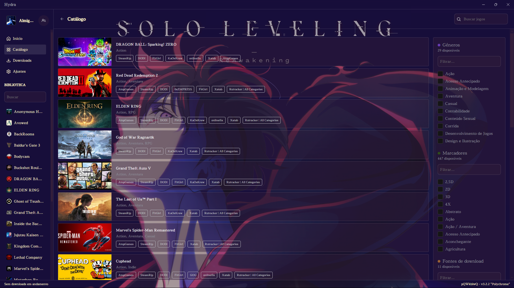

```markdown
# Shadow Monarch Theme



Shadow Monarch Theme é um tema para o Hydra Launcher inspirado na estética de Solo Leveling.  
Ele apresenta uma interface translúcida com efeitos neon e um fundo animado, proporcionando um visual único e moderno.

## Estrutura do Projeto

```
Shadow Monarch/
├── assets/
│   ├── background/
│   │   └── background-reflex.png
│   ├── icon/
│   │   └── subarashii.png
│   └── css/
│       └── theme.css
├── images/
│   └── result.png
├── theme-config.json
└── README.md
```

- **theme-config.json**: Contém as configurações básicas do tema.
- **assets/css/theme.css**: Arquivo com os estilos do tema.
- **assets/background/**: Contém a imagem de fundo.
- **assets/icon/**: Contém ícones (como o subarashii.png).
- **images/result.png**: Screenshot do tema.

## Configuração do Tema

O arquivo `theme-config.json` possui o seguinte conteúdo:

```json
{
  "themeName": "Shadow Monarch",
  "version": "1.0.0",
  "author": "AlmightyMatheus",
  "styles": "assets/css/theme.css"
}
```

## Licença

Este projeto está licenciado sob a [MIT License](LICENSE).
```